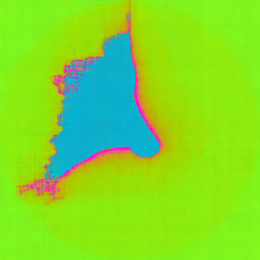
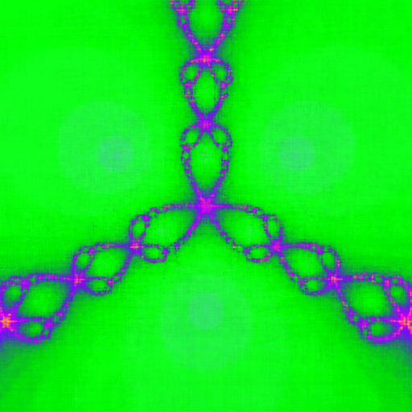

# neural_fractal
A neural fractal approximator built with <a href="https://pytorch.org/">PyTorch</a> that learns fractals such as: <b>Mandelbrot</b> & <b>Julia</b>. Images are rendered progressively during training, allowing monitoring the fractal evolution in real-time.





## Features
- Fractal presets: <code>mandelbrot</code>, <code>julia</code>, <code>burning_ship</code> & <code>newton</code>
- Image updates every epoch, reflecting current training process
- Most parameters are configurable via <b>YAML</b>
- Supports both CPU & GPU

## Requirements
- Python 3.10+
- Torch
- Torchvision
- Numpy
- Pillow
- Pyyaml
- Math (built-in)

## Configuration
1. Install requirements: 
```bash
pip install -r requirements.txt
```
2. Most parameters are configurable via <b>YAML</b>:
- <code>configs/default.yaml</code>: training & generation settings, including fractal preset.
- <code>configs/fractal.yaml</code>: fractal-specific parameters for each preset.

3. Train the model:
```bash
python train.py
```

## License
MIT License