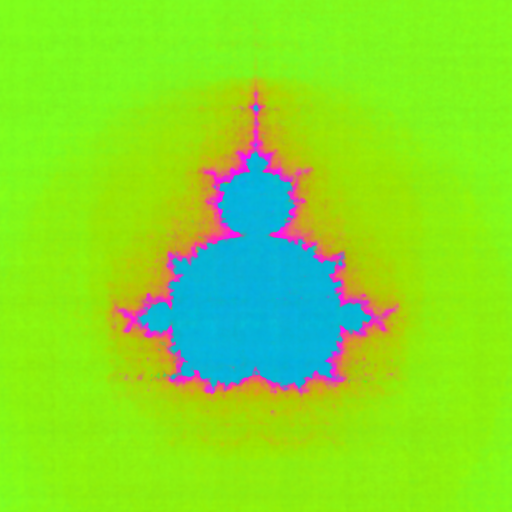
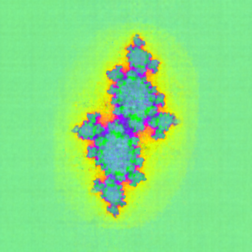
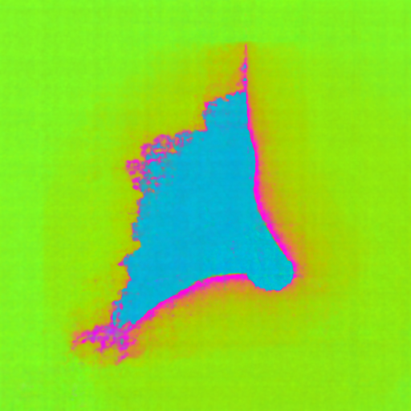
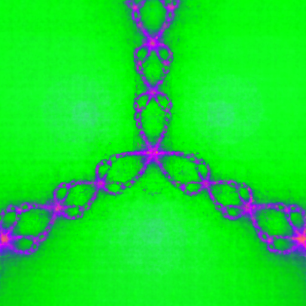

# neural_fractal
A neural fractal approximator built with <a href="https://pytorch.org/">PyTorch</a> that learns fractals such as: <b>Mandelbrot</b> & <b>Julia</b>. Images are rendered progressively during training, allowing monitoring the fractal evolution in real-time.

      

## Features
- Four fractal presets supported: Mandelbrot, Julia, Burning Ship & Newton
- Live image updates every epoch, reflecting immediate training process
- Full YAML configuration for model, training & fractal parameters
- Jupyter notebook for visualizing general convergence quality

## Requirements
- Python 3.10+
- Torch
- Torchvision
- Pillow
- Pyyaml
- Matplotlib

## Configuration
1. Install requirements: 
    - ```bash
        pip install -r requirements.txt
        ```
2. Most parameters are configurable via <b>YAML</b>:
    - <code>configs/default.yaml</code>: training & generation settings, including fractal preset.
    - <code>configs/fractal.yaml</code>: fractal-specific parameters for each preset.

## Running

1. Train the model:
    - ```bash
        python train.py
        ```

2. Results:
    - The fractal image updates every epoch in <code>live/fractal.png</code>.
    - As the model converges it will log training data in <code>log/</code>.
    - Logged data can then be analyzed in <code>analysis.ipynb</code>.

## License
MIT License